# 🌸 Perfume Shopping Website

<p align="center">
  
</p>

## 🌐 Live Demo

| Application | Link |
|--------------|------|
| 🛍️ Customer App | https://m-nova-frontend.onrender.com/ |
| 👨‍💼 Admin Dashboard | https://m-nova-admin.onrender.com/ |


## 📖 Overview

Perfume Shopping Website is a full-stack e-commerce platform that allows users to browse luxury perfumes, explore product details, manage their shopping cart, and securely place orders online.

The project consists of three main parts:

- 🛍️ Customer Website
- 👨‍💼 Admin Dashboard
- ⚙️ RESTful Backend API

The application was built using the MERN ecosystem and follows modern web development practices with secure authentication, image uploading, and online payment integration.

---

# ✨ Features

### 👤 Customer

- User Registration & Login
- JWT Authentication
- Browse Perfumes
- View Product Details
- Search Products
- Add to Cart
- Update Cart Quantity
- Remove Products from Cart
- Place Orders
- Stripe Payment Integration
- Order History
- Responsive Design

### 👨‍💼 Admin

- Admin Dashboard
- Add New Perfumes
- Upload Product Images
- Edit Products
- Delete Products
- View Customer Orders
- Update Order Status

### ⚙️ Backend

- RESTful API
- MongoDB Database
- JWT Authentication
- Password Encryption (bcrypt)
- Image Upload using Multer
- Environment Variables with dotenv

---

# 🛠 Tech Stack

### Frontend

- React
- Vite
- React Router DOM
- Axios
- HTML5
- CSS3
- JavaScript (ES6)

### Backend

- Node.js
- Express.js

### Database

- MongoDB
- Mongoose

### Authentication

- JSON Web Token (JWT)
- bcrypt

### File Upload

- Multer

### Payment

- Stripe API

### Other Libraries

- dotenv
- CORS
- body-parser
- validator

---

# 📸 Application Screenshots

| **🏠 Home Page** | **🌸 Menu** | **📋 Menu list** |
|:----------------:|:----------------------:|:--------------------:|
| 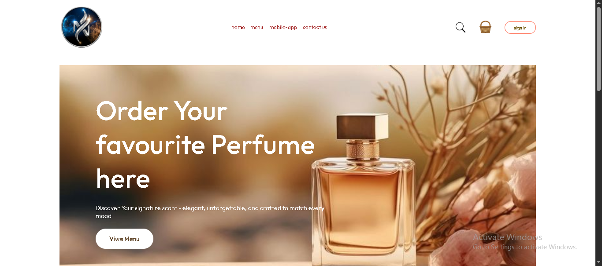 | 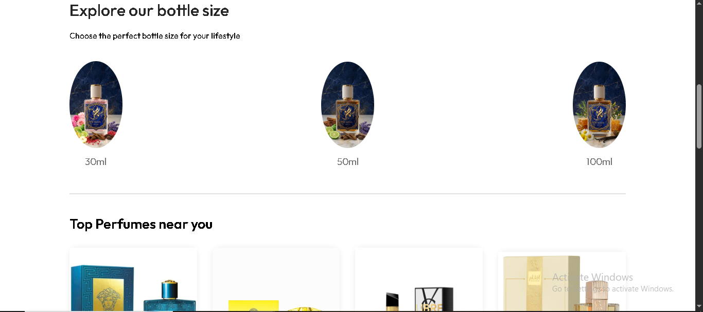 | 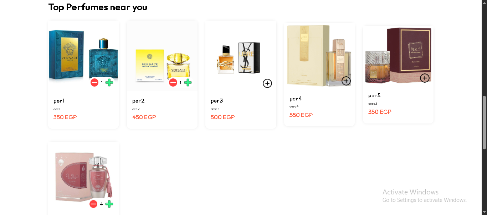 |

| **🔐 Login Page** | **📝 Register Page** | **🤝 Contanct Us** |
|:-----------------:|:--------------------:|:---------------:|
| 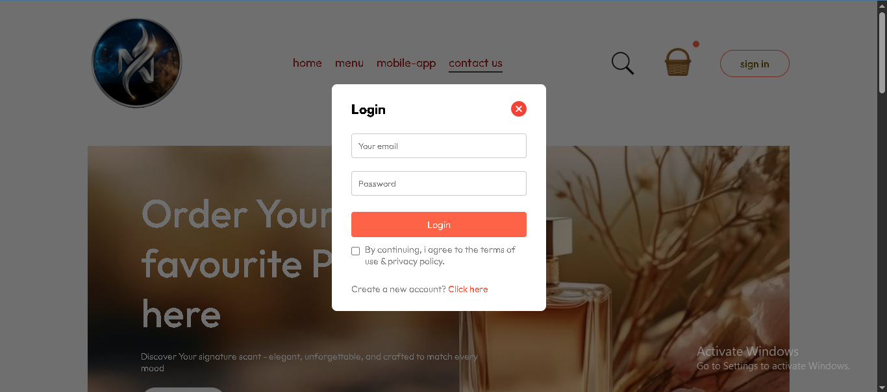 | 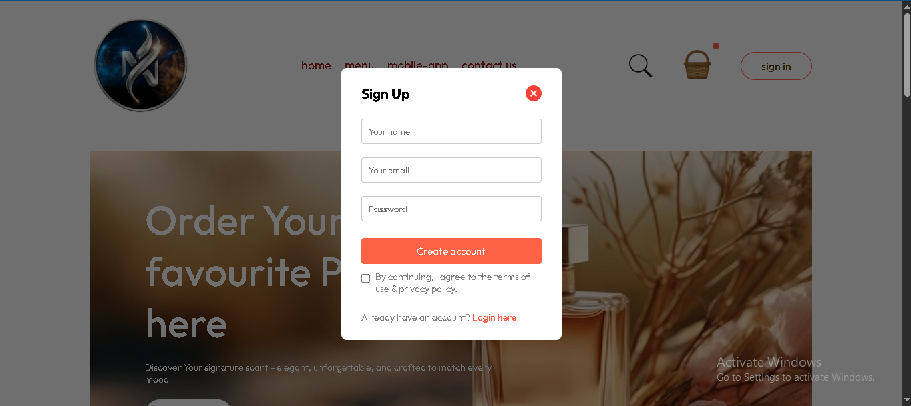 | 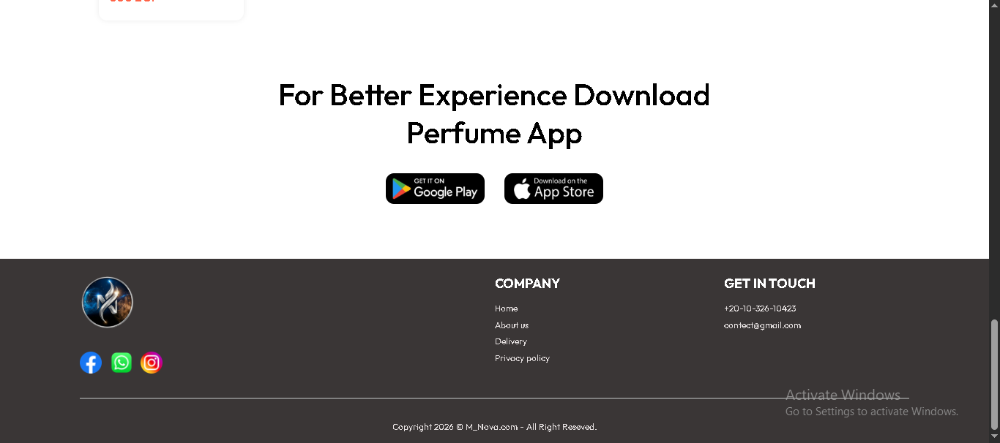 |

| **🛒 Cart** | **📃 User Information** | **💳 Payment** |
|:----------------:|:-----------------------:|:-----------------:|
| 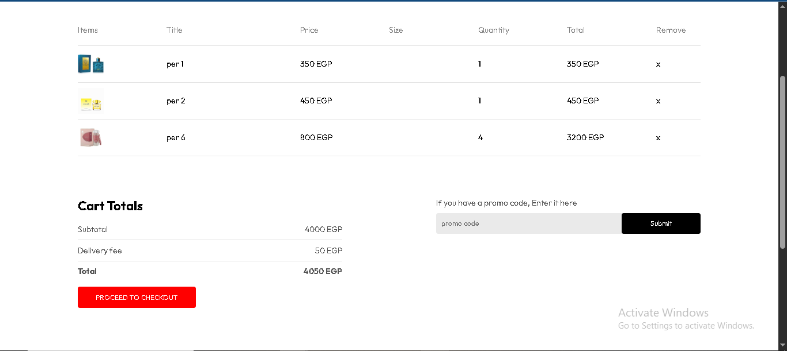 | 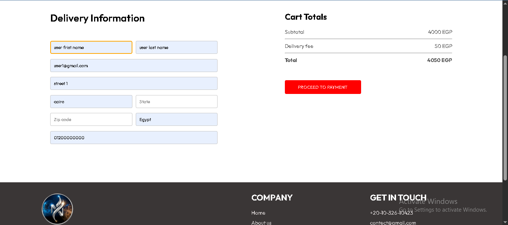 | 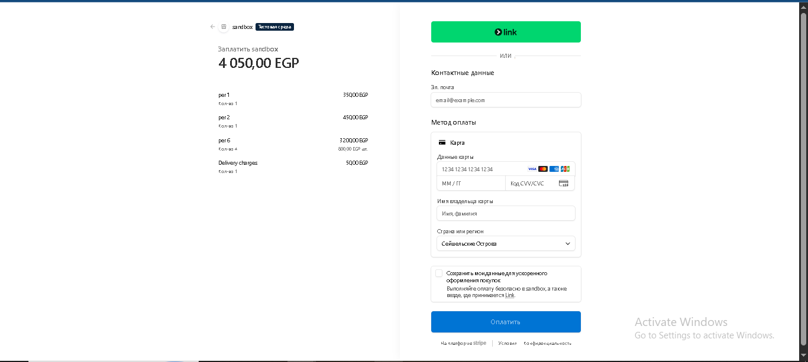 |

| **🛍 Orders** | **➕ Add Product** | **📋 Product List** |
|:----------------:|:-----------------------:|:-----------------:|
| 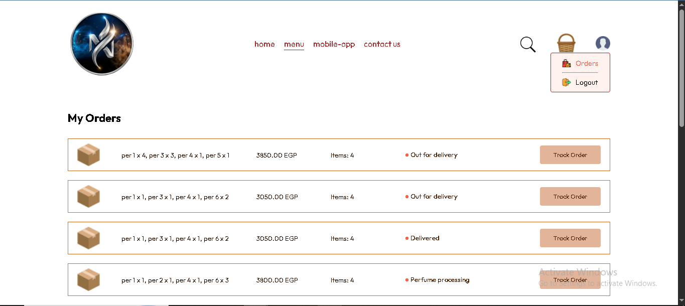 | 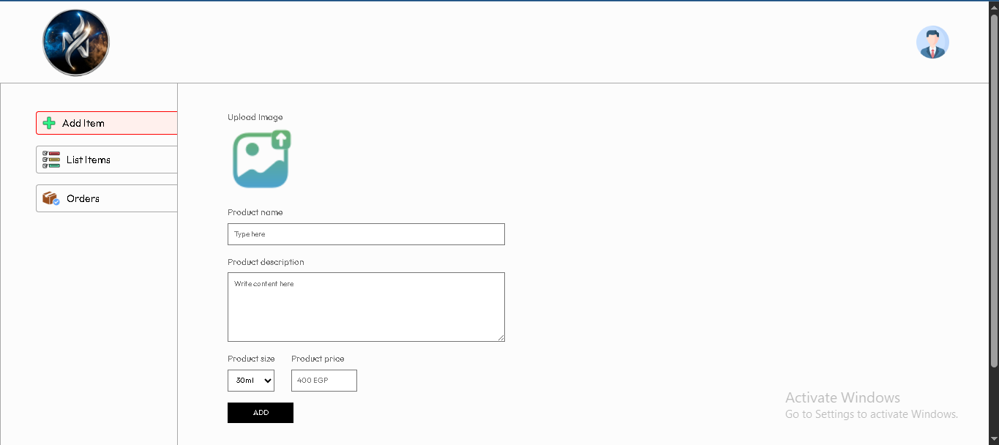 | 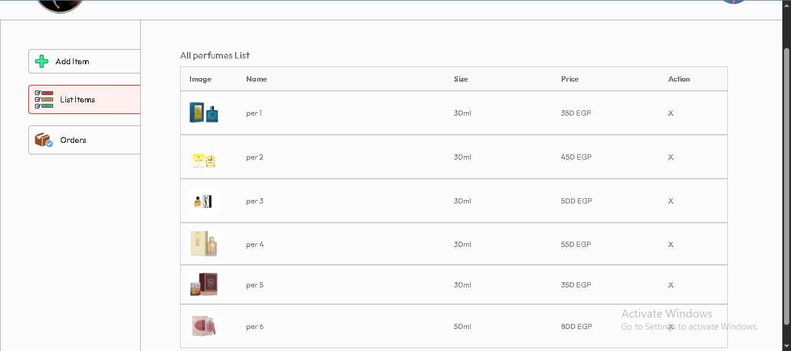 |

|  **🚚 Manage Orders** | 
|:-------------------:|
| 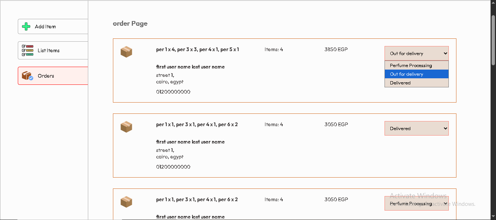 |

---

# 🚀 Installation

## Clone the Repository

```bash
git clone https://github.com/Maryam289/Website-Perfumes-Shopping.git
```

## Install Dependencies

### Frontend

```bash
cd frontend
npm install
npm run dev
```

### Backend

```bash
cd backend
npm install
npm run server
```

### Admin Dashboard

```bash
cd admin
npm install
npm run dev
```

---

# 🔐 Environment Variables

Create a `.env` file inside the backend folder and configure the following variables:

```env
MONGODB_URI=
JWT_SECRET=
STRIPE_SECRET_KEY=
```

---

# 📂 Project Structure

```text
Website-Perfumes-Shopping
│
├── frontend
│
├── backend
│   ├── config
│   ├── controllers
│   ├── middleware
│   ├── models
│   ├── routes
│   └── uploads
│
├── admin
│
├── screenshots
│
└── README.md
```

---

# 🔮 Future Improvements

- ❤️ Wishlist
- ⭐ Product Reviews & Ratings
- 🔍 Advanced Product Filtering
- 📦 Inventory Management
- 📈 Sales Analytics Dashboard
- 🔔 Email Notifications
- 🌍 Multi-language Support
- 📱 Android App

---

# 👩‍💻 Author

**Maryam**

GitHub:
https://github.com/Maryam289

---

# 📄 License

This project was developed for educational purposes.
