# 🌸 Perfume Shopping Website

<p align="center">  </p>

<p align="center"> A full-stack MERN e-commerce platform for browsing perfumes, exploring curated collections, managing carts, and placing orders. </p>

## 🌐 Live Demo

| Application | Link |
|--------------|------|
| 🛍️ Customer App | https://m-nova-frontend.onrender.com/ |
| 👨‍💼 Admin Dashboard | https://m-nova-admin.onrender.com/ |


## 🎥 Project Demo

A short demonstration of the Perfume Shopping Website in action.

<p align="center"> Watch the project in action: </p>

<p align="center"> <a href="https://drive.google.com/file/d/1-GKckb1gcPs3sYst-4TDW4NU8vckXBow/view?usp=drive_link"> 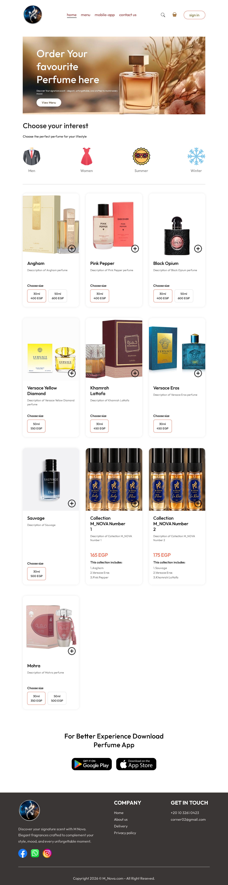 </a> </p>

<p align="center"> 👆 Click the image above to open the project demo video. </p>


## 📖 Overview

Perfume Shopping Website is a full-stack e-commerce platform that allows customers to browse perfumes and collections, view product details, select perfume sizes, manage their shopping cart, and place orders.

The project consists of three main parts:

- 🛍️ Customer Website
- 👨‍💼 Admin Dashboard
- ⚙️ RESTful Backend API

The application was built using the MERN ecosystem and includes authentication, product management, image uploading, shopping cart functionality, collection management, and order management.

---

# ✨ Features

### 👤 Customer

- User Registration & Login
- JWT Authentication
- Browse Perfumes
- Search Products
- View Product Details
- Explore Perfume Collections
- View Collection Details
- Display the perfumes included in each collection
- View perfume names and descriptions
- View product images
- Select perfume size before adding to cart
- Different prices for different perfume sizes
- Add Products to Cart
- Update Cart Quantity
- Remove Products from Cart
- View Cart Subtotal
- Enter Customer Delivery Information
- Place Orders
- Order Confirmation
- View Order History
- Responsive Design


### 🎁 Collections

Collections allow customers to purchase multiple perfumes together.

Customers can:

- View the collection name
- View the collection description
- View the collection price
- See the names of the perfumes included in the collection
- Open a dedicated collection details page
- View the included perfumes as individual cards
- View each perfume's:
  - Image
  - Name
  - Description
  - Available sizes
  - Price


### 👨‍💼 Admin

- Admin Dashboard
- Add New Perfumes
- Add Multiple Sizes for a Perfume
- Set Different Prices for Each Size
- Add Perfume Collections
- Add Products to Collections
- Upload Product Images
- View All Products
- View Product Type
- View Available Sizes
- View Prices for Each Size
- View Products Included in Collections
- Delete Products
- Delete Individual Perfume Sizes
- View Customer Orders
- View Ordered Products
- View Selected Perfume Size
- View Product Quantity
- View Customer Information
- Update Order Status

### 🛒 Cart & Order Management

The shopping cart supports:

- Perfumes with different sizes
- Different prices depending on selected size
- Multiple products
- Individual product quantities
- Collection products
- Cart persistence for authenticated users
- Correct subtotal calculation

When an order is placed, the backend validates the cart information and calculates the order amount using the actual product and selected size stored in MongoDB.

Each order stores important product information including:

- Product ID
- Product name
- Product image
- Product type
- Selected size
- Price
- Quantity
- Total price
- Customer address
- Payment status
- Order status


### ⚙️ Backend

- RESTful API
- MongoDB Database
- Mongoose
- JWT Authentication
- Password Encryption using bcrypt
- Authentication Middleware
- Product Management APIs
- Collection Management
- Shopping Cart APIs
- Order Management APIs
- Image Upload using Multer
- Environment Variables using dotenv
- CORS Configuration
- Server-side Order Validation

---

# 💳 Payment

Stripe payment integration has been prepared in the backend for future online payment functionality.

The current version supports placing orders without requiring online payment.

---

# 🛠 Tech Stack

### Frontend

- React
- Vite
- React Router DOM
- Axios
- HTML5
- CSS3
- JavaScript ES6
  
### Backend

- Node.js
- Express.js

### Database

- MongoDB
- Mongoose

### Authentication

- JSON Web Token (JWT)
- bcrypt

### File Upload

- Multer

### Payment

- Stripe API

### Other Libraries

- dotenv
- CORS
- body-parser
- validator

---

# 📸 Application Screenshots

| **🏠 Home Page** | **🌸 Classification Selection** | **📋 Collection Details** |
|:----------------:|:----------------------:|:--------------------:|
|  | 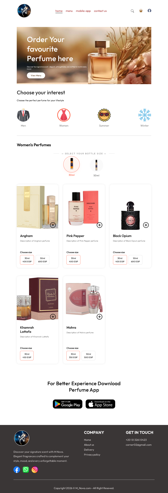 | 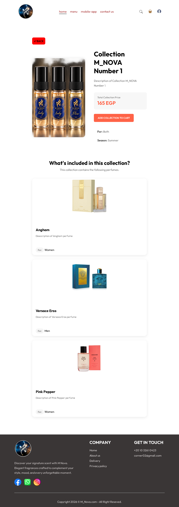 |

| **🔐 Login Page** | **📝 Register Page** | **🛒 Cart** |
|:-----------------:|:--------------------:|:---------------:|
| 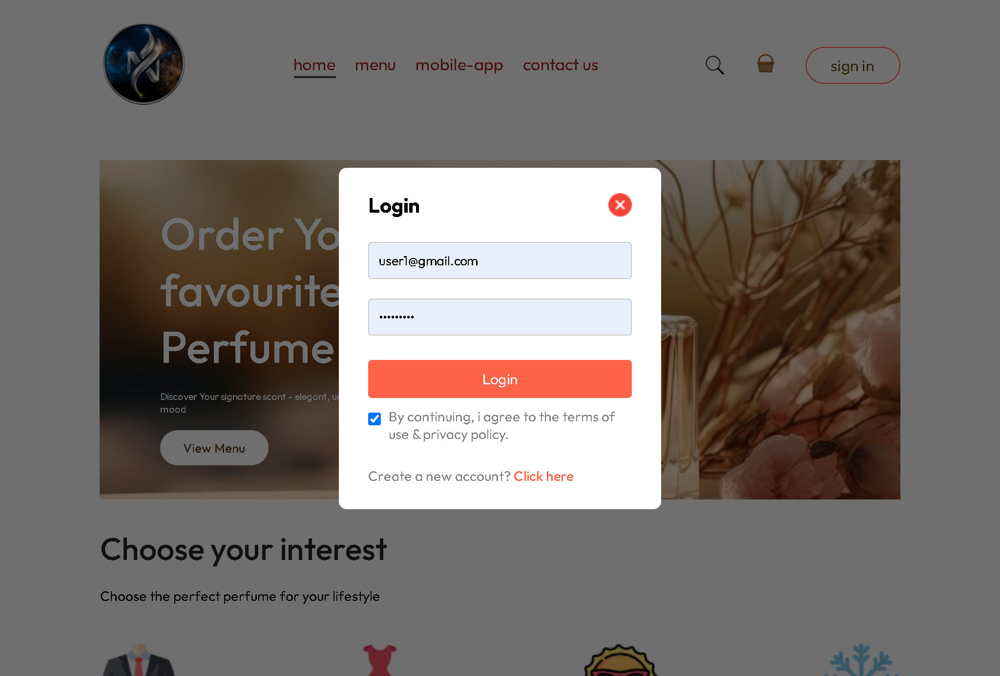 | 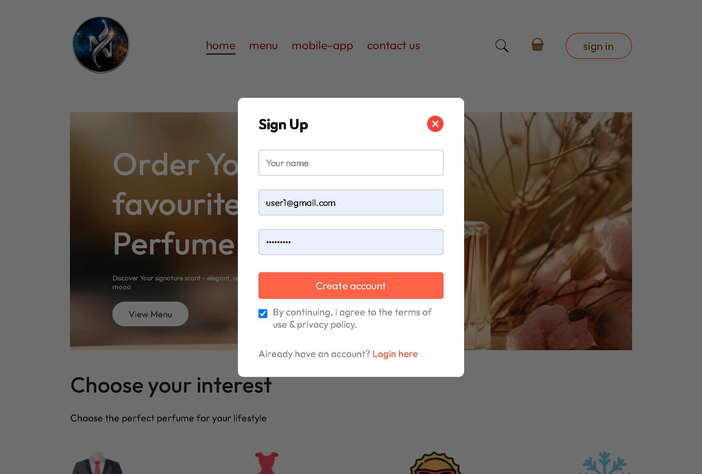 | 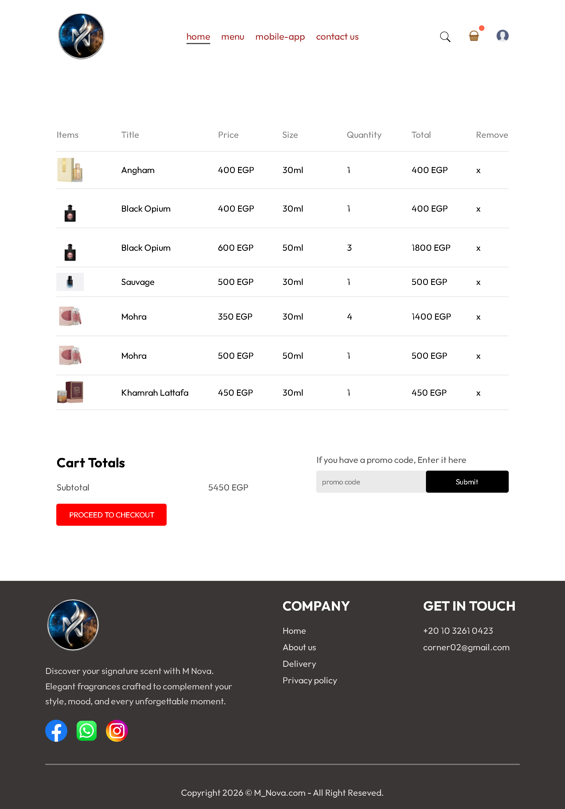 |

| **📃 User Information**  | **✅ Order Placed** | **🛍 User's Orders** |
|:----------------:|:-----------------------:|:-----------------:|
| 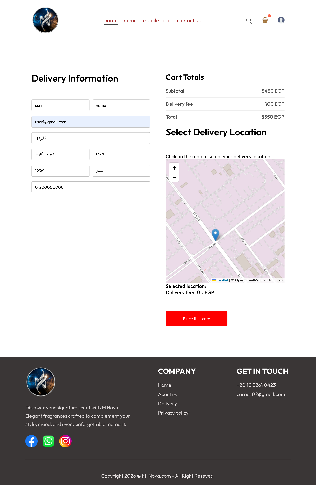 | 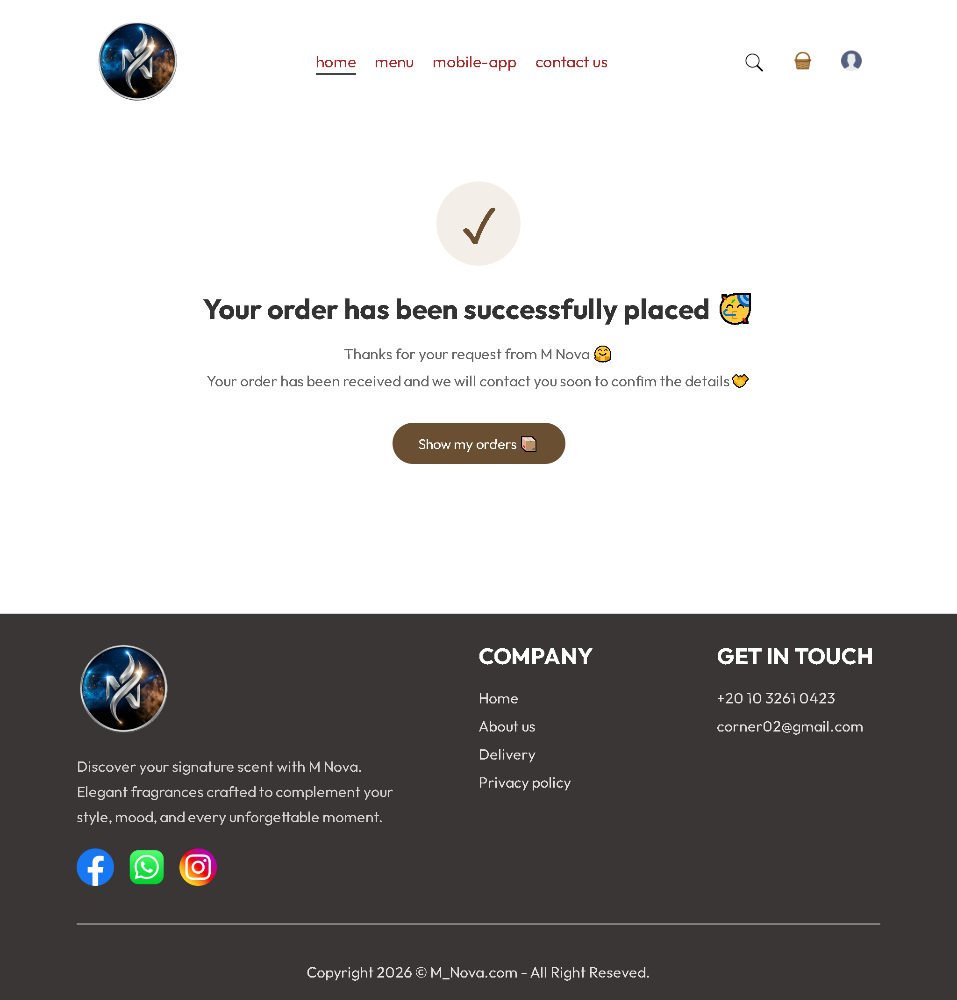 | 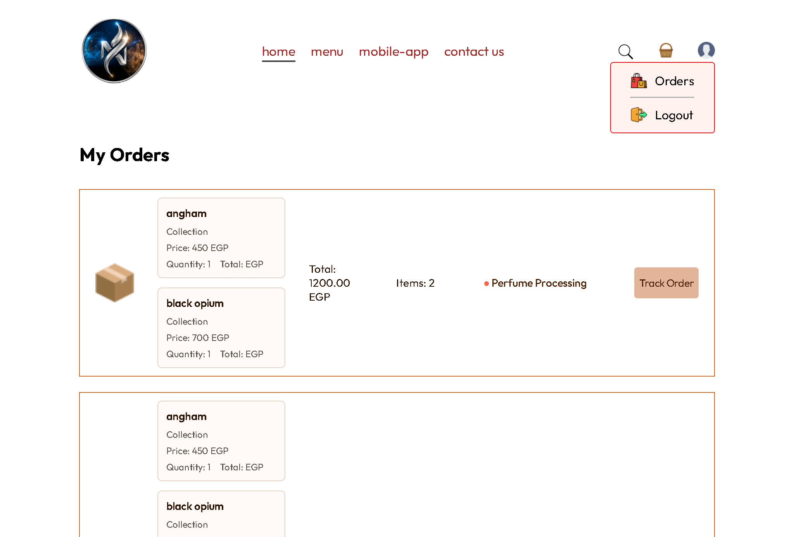 |

| **➕ Add Perfume Product** | **➕ Add Collection Product** | **📋 List** |
|:----------------:|:-----------------------:|:-----------------:|
| 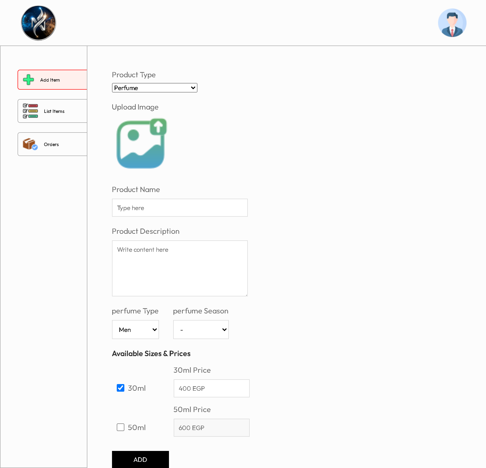 | 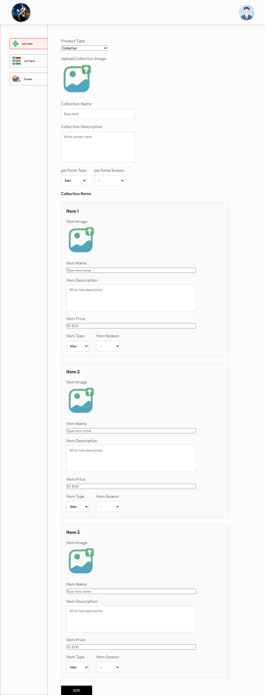 | 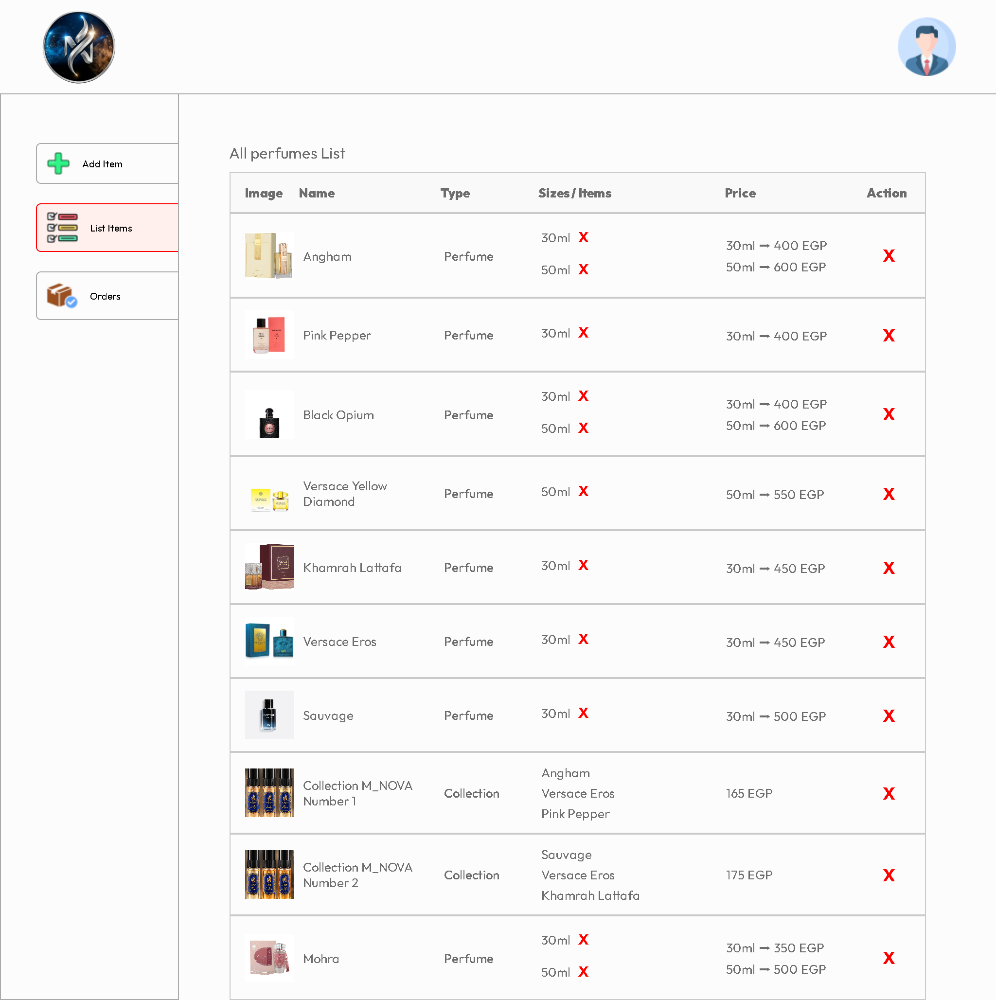 |

|  **🚚 Manage Orders** | 
|:-------------------:|
| 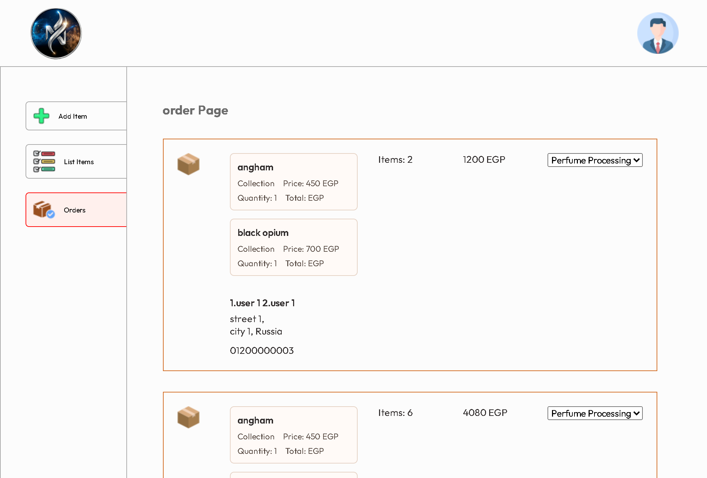 |

---

# 🚀 Installation

## Clone the Repository

```bash
git clone https://github.com/Maryam289/Website-Perfumes-Shopping.git
```

## Install Dependencies

### Frontend

```bash
cd frontend
npm install
npm run dev
```

### Backend

```bash
cd backend
npm install
npm run server
```

### Admin Dashboard

```bash
cd admin
npm install
npm run dev
```

---

# 🔐 Environment Variables

Create a `.env` file inside the backend folder

---

# 📂 Project Structure

```text
Website-Perfumes-Shopping
│
├── frontend
│   └── src
|       ├── components
|       ├── context
|       ├── assets
|       └── pages
|           ├── Home
│           ├── Cart
│           ├── PlaceOrder
│           ├── CollectionDetails
│           ├── MyOrders
│           ├── About
│           ├── Delivery
│           └── PrivacyPolicy
|
├── backend
│   ├── config
│   ├── controllers
│   ├── middleware
│   ├── models
│   ├── routes
│   └── uploads
│
├── admin
|   └── src
|       ├── components
│       └── pages
│           ├── Add
│           ├── List
│           └── Orders
│
├── screenshots
│
└── README.md
```
# 🔄 Application Flow

```text
Customer
  ↓ 
Browse Perfumes / Collections 
  ↓ 
Select Perfume Size 
  ↓ 
Add to Cart 
  ↓ 
Cart stored for the User 
  ↓ 
Checkout 
  ↓ 
Backend reads Cart from MongoDB 
  ↓ 
Backend verifies Product and Size 
  ↓ 
Backend retrieves Real Price from MongoDB 
  ↓ 
Secure Order Total Calculation 
  ↓ 
Order Saved 
  ↓ 
Admin Manages the Order
```
---

# 🔮 Future Improvements

- ❤️ Wishlist
- ⭐ Product Reviews & Ratings
- 📦 Inventory Management
- 📈 Sales Analytics Dashboard
- 🔔 Email Notifications
- 🌍 Multi-language Support
- 🏷️ Promo Code System
- 📱 Android App
- 💳 Enable Online Stripe Payments
  
---

# 👩‍💻 Author

**Maryam**

GitHub:
https://github.com/Maryam289

---

# 📄 License

This project was developed for educational purposes.
